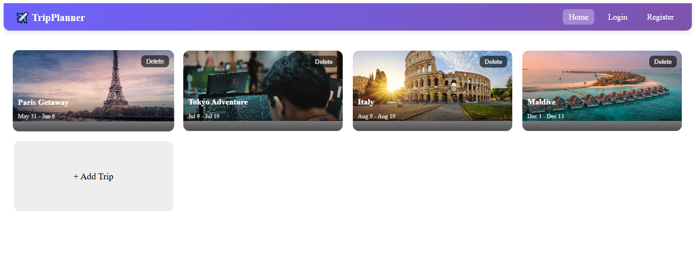
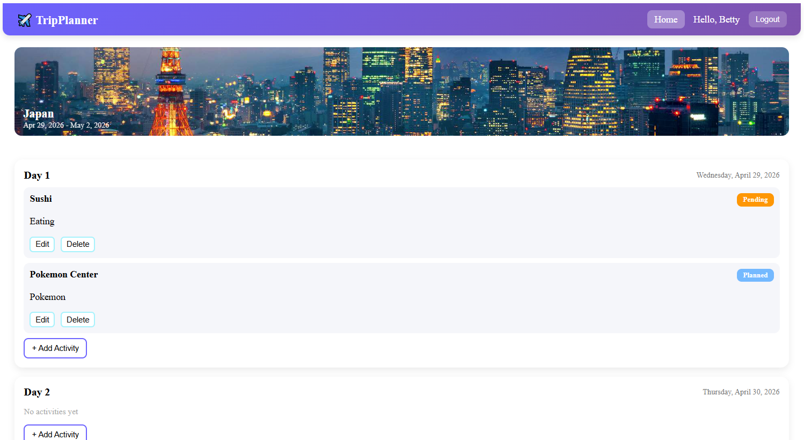
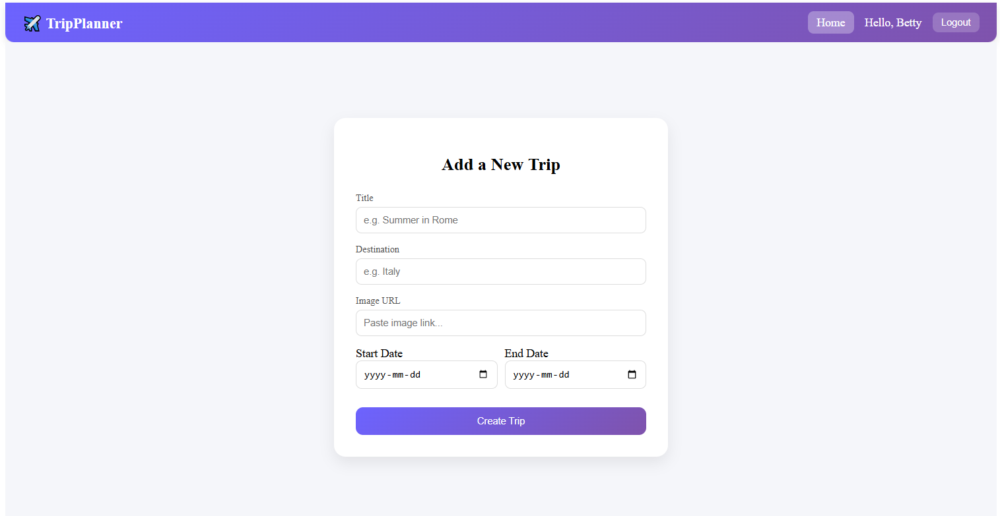
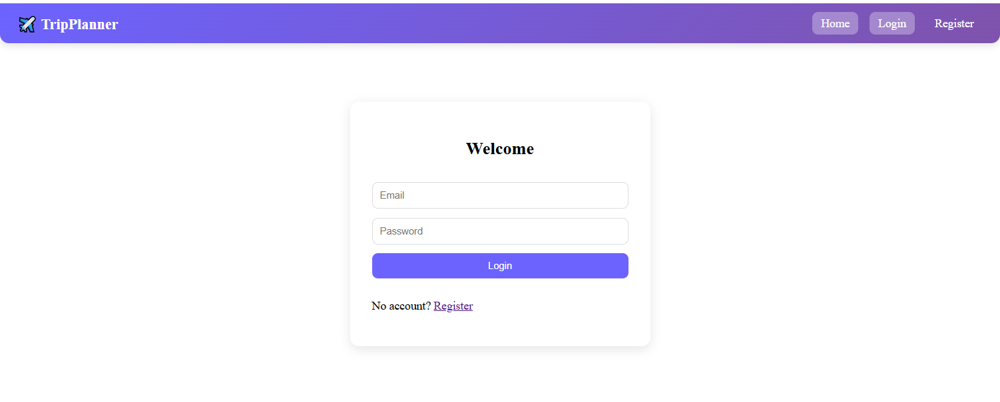
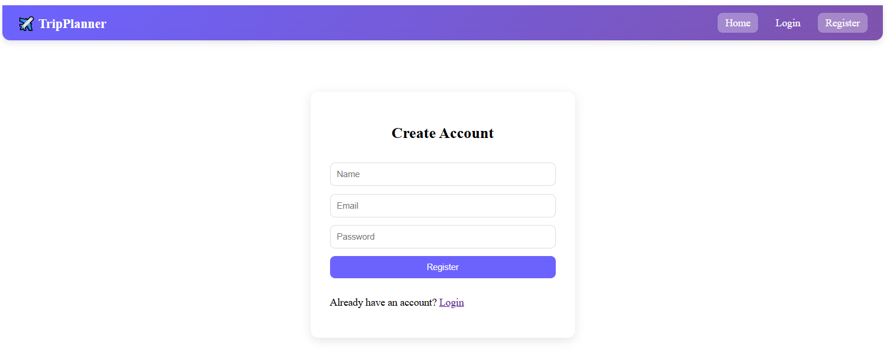

# ✈️ Trip Planner

## 📌 Project Overview

Trip Planner is a full-stack web application that allows users to create and manage future trips.
Users can organize their journey day by day, add activities, and track the status of each activity (planned, pending, completed).

The goal of this project is to provide a simple and interactive way to plan trips while demonstrating full-stack development concepts such as authentication, CRUD operations, and real-time updates.

---

### Key Screens:

* 🏠 Home page (Trip list)
* 📄 Trip detail page (daily planning)
* ➕ Add activity form
* 🔐 Authentication (Login/Register)

## 🖼️ Application Preview

### 🏠 Home Page


### 📄 Trip Page



### ➕ Add Activity



### 🔐 Login Page



### 🔐 SignUp Page




## 🚀 Features

* 🔐 User Authentication (JWT)
* 🧳 Create and manage trips
* 📅 Plan trips by day
* 📝 Add, edit, and delete activities
* 📊 Activity status tracking (planned, pending, completed)
* ⚡ Real-time updates using WebSockets
* 🗑 Delete trips and activities

---

## 🛠️ Tech Stack

### Frontend

* Angular

### Backend

* Node.js
* Express.js

### Database

* MongoDB

### Other

* JWT Authentication
* Bcrypt (password hashing)
* Socket.IO (real-time features)

---

## ⚙️ Setup Instructions

### 1️⃣ Clone the repository

```bash
git clone https://github.com/YOUR_USERNAME/YOUR_REPO_NAME.git
cd YOUR_REPO_NAME
```

---

### 2️⃣ Backend Setup

```bash
cd backend
npm install
```

#### Create a `.env` file in `/backend`:

```env
PORT=3000
MONGODB_URI=your_mongodb_connection_string
JWT_SECRET=your_secret_key
```

#### Run backend:

```bash
npm start
```

---

### 3️⃣ Frontend Setup

```bash
cd frontend
npm install
ng serve
```

Frontend will run on:

```text
http://localhost:4200
```

---

## 🌐 Deployment

* Backend deployed on Render
* Frontend deployed on Render

👉 Live App: [ADD YOUR LINK HERE]

---

## 📡 API Endpoints (Examples)

### Auth

* POST `/auth/register`
* POST `/auth/login`

### Trips

* GET `/trips`
* POST `/trips`
* PUT `/trips/:id`
* DELETE `/trips/:id`

### Activities

* GET `/activity/trips/:tripId/activities`
* POST `/activity/trips/:tripId/activities`
* PUT `/activity/:id`
* DELETE `/activity/:id`

---

## 🔄 Real-Time Features

* Trip updates (create, update, delete)
* Activity creation updates in real-time

---

## 📽️ Demo

👉 [Add your video link here]

---

## 📄 Environment Variables

Make sure to configure:

```env
MONGODB_URI=
JWT_SECRET=
PORT=
```

---

## 👨‍💻 Author

Betty Dang
Course: Trends in Technology (W2026)

---
